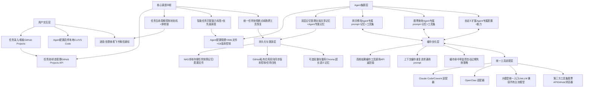

# 多Agent工作流落地执行方案（终版·无遗漏）

核心目标：以“轻量化、快落地、低运维、全适配”为原则，按阶段完成多Agent协同工作流搭建，1-2天跑通MVP，1周内实现全功能落地，100%匹配优化后的核心需求，确保多Agent协同闭环完成任务池所有任务。

## 一、整体架构设计（优化精简版，个人友好）

### 1.1 核心架构图（可直接渲染使用）

### 1.2 架构模块说明（对应核心需求）

1. 用户交互层：零开发开箱即用，通过GitHub Projects管理任务、CLI配置Agent，飞书/微信接收告警，操作便捷。

2. 核心调度中枢：轻量化Python脚本实现，替代重服务，实现任务分发、状态管理、快照备份，核心解决任务自动认领与断点续跑。

3. 缓存优化层：对应前期重点讨论的Cache hit机制，实现高频工具调用、重复请求结果的缓存复用，核心解决Agent降本提效、降低API调用成本的需求。

4. Agent集群层：按能力/任务分工，支持动态配置与版本控制，双层记忆体系避免重复提示，可无限扩展。

5. 统一工具适配层：标准化接口，兼容Claude Code、OpenClaw等工具，实现跨工具无缝恢复。

6. 持久化与漫游层：NAS+GitHub双备份，实现跨设备漫游，Git天然实现版本控制，降低运维成本。

### 1.3 核心落地规范（全需求匹配，无遗漏）

#### 1.3.1 统一任务快照规范（跨工具状态恢复核心）

1. 固定命名规则：快照文件以「任务ID_当前时间戳.json」命名，存储于task-snapshots/任务ID/目录下，NAS与GitHub双向同步。

2. 固定字段规范：快照必须包含任务全量信息、当前执行步骤、已完成内容、上下文依赖、关联Agent配置版本、工具执行记录，确保所有工具均可读取解析。

3. 更新规则：Agent每完成一个执行步骤，自动更新快照；任务中断/暂停时，自动生成最终快照，确保跨工具、跨设备可100%恢复执行状态。

#### 1.3.2 Agent能力与记忆物理隔离规则

1. 能力配置独立：每个Agent的能力、prompt、性格、工具权限，均独立存储于agents/对应Agent目录下的config.yaml文件，互不干扰，修改不影响其他Agent。

2. 记忆数据独立：每个Agent的专属记忆，独立存储于agents/对应Agent目录下的memory/文件夹，仅当前Agent可读写；全局通用记忆存储于global-memory/目录，所有Agent只读，不可修改。

3. 版本绑定规则：每个任务执行时，自动绑定对应Agent的配置版本，接续任务时自动加载对应版本的能力配置，避免动态修改配置导致的上下文冲突。

## 二、核心技术选型（全开源免费、个人友好，轻量化落地）

|架构模块|最终选型|核心优势|适配需求点|
|---|---|---|---|
|任务池/看板/状态管理|GitHub Projects|零开发、开箱即用，自带API与状态管理，替代Redis+FastAPI，零运维|任务池搭建、全流程跟踪|
|任务调度/Agent执行|Python脚本 + LiteLLM|轻量化、易调试，无服务依赖，统一大模型入口，适配多工具|任务自动分配、多工具兼容|
|缓存优化层|本地JSON文件 + 内存缓存|零额外依赖，支持TTL过期策略，天然适配NAS/GitHub同步，实现Cache hit降本提效|API成本控制、重复请求优化、提升响应速度|
|配置/快照/记忆存储|YAML/JSON文件 + Git|零配置、易修改，Git实现版本控制与跨设备同步，替代SQLite|长久记忆、漫游部署、动态配置|
|可选超长语义记忆|Chroma 轻量向量库|Docker一键部署，按需启用，降低前期落地门槛|Agent长久记忆扩展|
|运行环境|群晖NAS（定时任务）+ 本地Python|无需常驻Docker服务，按需启动，降低NAS性能占用|漫游部署、稳定运行|
|告警通知|飞书/微信通知接口|配置简单，实时接收异常告警，无需额外工具|异常兜底机制|
## 三、分阶段落地执行步骤

### 3.1 前期准备阶段（预计0.5天，零代码开发）

1. GitHub私有仓库搭建：创建私有仓库「multi-agent-workflow」，分别克隆到群晖NAS和本地电脑，搭建标准化目录结构（agents/、config/、global-memory/、task-snapshots/、scripts/、docs/），实现配置、记忆、快照的版本控制与跨设备同步。

2. 群晖NAS环境配置：安装Python3、Git套件，开启SSH权限，配置GitHub免密登录；创建定时任务（每10分钟执行一次Git双向同步），确保NAS与GitHub数据一致；安装核心依赖（litellm、PyGithub、python-dotenv），完成Python环境调试。

3. 任务看板搭建：在GitHub Projects创建任务看板，配置6个状态列（待认领→已认领→执行中→待确认→已归档→已驳回），添加自定义字段（任务ID、优先级、能力标签、负责Agent、创建时间、截止时间、执行日志），完成任务管理基础配置。

4. 验收标准：NAS与GitHub仓库双向同步正常，任务看板配置完成，本地与NAS均可正常访问仓库及看板，Python依赖安装成功。

### 3.2 MVP核心落地阶段（预计0.5天，核心流程跑通）

1. 核心调度脚本与缓存机制开发：基于PyGithub编写调度脚本，实现任务池读取、能力标签匹配、优先级排序、任务认领排他锁、任务状态自动更新功能；定义统一任务快照JSON格式，实现每执行一步自动更新快照（存储至NAS/ GitHub task-snapshots目录），支持断点续跑；同步开发本地缓存模块，实现高频工具调用、重复请求结果的缓存复用，配置TTL自动过期策略，落地Cache hit降本提效能力。

2. 双示例Agent开发：按需求编写网页修改Agent、股票查询Agent的YAML配置文件（含专属prompt、能力标签、工具关联信息），实现双层记忆管理（读取全局通用记忆+独立存储专属记忆）；对接Claude Code、OpenClaw工具，完成基础执行能力调试。

3. 多工具适配层开发：基于统一快照规范，开发Claude Code、OpenClaw极简适配器，实现工具读取快照、执行后更新快照与任务状态的功能，确保跨工具无缝恢复任务。

4. 验收标准：GitHub看板创建2个不同标签任务，调度脚本自动匹配对应Agent认领执行；中断重启后可通过快照无缝接续任务；跨工具切换可正常恢复任务上下文，任务状态实时同步至看板。

### 3.3 进阶功能完善阶段（预计1-2天，全需求覆盖）

1. Agent动态配置优化：实现Agent配置热加载功能，修改YAML配置后无需重启脚本即可自动生效；添加配置版本管理，每次修改自动生成版本号，历史任务绑定对应执行版本，避免上下文冲突。

2. 异常兜底机制搭建：添加任务超时控制（自定义超时阈值）、失败自动重试（最多3次）、异常告警（对接飞书/微信通知）、僵尸任务自动归档功能，避免任务池阻塞。

3. 可选功能扩展：按需部署Chroma轻量向量库，为Agent添加超长语义记忆检索能力；优化缓存机制，对高频工具调用、重复查询结果进行缓存，降低API调用成本。

4. 验收标准：Agent配置动态修改生效，无重启依赖；异常场景（超时、失败、卡死）可正常兜底，告警通知及时；跨设备漫游同步正常，全需求100%覆盖。

### 3.4 测试优化与运维阶段（预计1天，稳定落地）

1. 全流程测试：模拟真实使用场景，完成“批量创建任务→自动分发→执行→中断→跨工具恢复→跨设备漫游→归档”全流程验证；测试Agent记忆隔离性、配置版本回滚、异常容错能力。

2. 效率优化：优化任务匹配逻辑，提升Agent认领效率；优化记忆检索策略，减少重复提示；清理冗余代码，降低NAS性能占用。

3. 运维体系完善：编写NAS开机自启、异常自动重启脚本；编写操作手册、异常处理手册；配置看板数据可视化，实时查看任务完成率、Agent执行效率。

4. 验收标准：全流程无阻塞，系统可7×24小时稳定运行；操作便捷，运维成本低；完全适配个人使用场景，可直接投入日常使用。

## 四、关键注意事项（落地避坑核心）

1. 数据安全：API密钥、敏感信息存储在.env文件中，禁止提交至Git仓库；NAS开启访问权限控制，避免数据泄露。

2. 成本控制：通过缓存机制减少大模型API调用次数，降低订阅成本；优先复用成熟工具，不盲目开发冗余功能。

3. 任务粒度：单个任务拆分为可分步执行的子任务，降低快照恢复复杂度，提升执行成功率。

4. 渐进式扩展：先稳定运行MVP版本，再逐步新增Agent、扩展功能，避免一次性引入过多复杂度。
> （注：文档部分内容可能由 AI 生成）